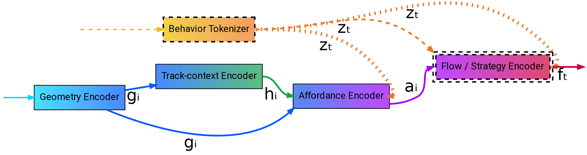

# Kartographer

## The difficult nature of a layout design: track geometry as strategy

Understanding a race track requires more than analyzing its geometry; it requires understanding the strategy that geometry enforces. While raw geometry (KCL/3D Mesh) is the input, the output must account for the chaotic, competitive nature of Mario Kart Wii.

The hard part is that race outcomes in Mario Kart Wii are not determined by geometry alone. Track geometry absolutely influences how the game is played, but often indirectly: what matters is what the geometry means for strategy, item usage, routing options, risk/reward, and situational awareness across three laps. Races are chaotic, and optimal play is rarely "drive as fast as possible for three laps." While technical inputs (drifting, tech strats) are present, the deciding factors are usually macro-strategies: reading the situation, adapting to other players, and choosing when to take risks.

This makes MKW very different from time-trial-focused games like Trackmania. MKW tracks can be extreme and janky, with shortcuts, ramps, split paths, and wild layouts. Item play is central, and many strategic decisions exist specifically because of items and traffic.

## Why these inputs?

We could have chosen many different input representations. For example, the first iteration used tracks as a heightmap (an image where each pixel's color encodes height) and viewed the problem as a image generation task (VAE and GAN where explored). So why switch to these data sources?

First, because MKW track geometry is author-defined. The full 3D model is created by the track maker, not assembled from predefined blocks (like in Trackmania). That means a track can be almost anything: shortcuts, ramps, split paths, unusual layouts, and extreme or "janky" local geometry. These elements directly shape gameplay, and players judge quality on both:

* Global layout: flow, route choices, shortcuts, and player interaction possibilities
* Local feel: awkward surfaces, weird bumps (that may or may not be fun), and tech that isn't fun or readable

To capture this faithfully, we need access to the raw geometry. On top of that, KCL adds important semantic information by labeling each triangle with a collision type, which affects how the game actually behaves on that surface.

So why add telemetry?

During the first iteration, one limitation became obvious: we don't have (and realistically won't ever have) enough unique tracks to train a robust model from track data alone. In the best case we can collect around 5,000 tracks, and a large fraction of them are low quality (not as an insult to creators, just a practical dataset issue). That pushed the question: what other data can we gather at large scale that directly reflects "good track design"?

The answer is races. Telemetry tells us how players actually interact with the geometry, which is a much more direct signal of what a track enables: strategy, routing, risk/reward, pace changes, and where decision-making happens.

This also connects to a broader idea: a player who has raced for years (even without any track-building experience) often develops an internal sense of what works and what doesn't. They may not be able to formalize it, but they can predict that a certain design will play poorly, and often have an intuition for why. In ML terms, that's close to learning a ***<ins>"world model"</ins>***: an internal predictive model of how the game responds to geometry and race context.

### Why self-supervised learning?
* Overcoming the annotation bottleneck: High-quality annotations would require **specialized domain knowledge**. Running a large community labeling campaign isn’t a good fit for a personal project, and outsourcing to a generic annotation vendor would likely produce noisy or inconsistent labels.
* Supervised learning optimizes for the labels you define, which can bake in annotation limits and bias. SSL learns directly from the structure of the raw data, which often leads to more general, **reusable representations** and can surface patterns that are **difficult to specify upfront or annotate reliably**.

---

## Technical details

<!-- Technically, the project aim at building a self-supervised learning backbone that links static 3D collision geometry to multiplayer time-series telemetry (e.g., ~50 game engine signals per player, 12 players, 60 Hz). The model is designed to learn what a track section affords and what typically happens there under real competitive play: geometry is embedded at a local/segment level, then paired with aligned telemetry to learn representations that are predictive of distributions of behaviors (speed patterns, drifting, item usage, overtakes, shortcut taking) while remaining robust to the inherent chaos of race strategy.  -->

### Downstream applications

The backbone can be apply to multiple downstream applications, such as:

- **Multi-scale track embeddings:** Produce embeddings at different granularities—per segment, per section, or for an entire lap (multi-scale). By attaching lightweight task-specific heads to these embeddings, we can perform complex analytical tasks, such as:
    *   **Tactical Segmentation:** Automatically decomposing tracks into distinct "phases" or rhythm sections.
    *   **Geometry Forensics:** Identifying specific geometric features that statistically lead to "pack fights" (clumping) versus "breakaways" (spread).
    *   **Flow Analysis:** Detecting flow bottlenecks, difficulty spikes, and strategic decision points.

- **Circuit generation:** Generate new circuits (ideally conditioned on high-level attributes or embedding targets), aiming for layouts that are coherent, playable, and tuned to desired strategic rhythm.

- **Circuit editing:** Regenerate a missing or undesired subsection given the surrounding context; e.g., delete a chicane or mid-sector and ask the model to propose replacements that preserve continuity and intent (or change intent).

- Search, retrieval, and similarity for turns, section, tracks.

- Race analysis (fully supported but secondary use-case).

---

## Backbone design blueprint

We will factor the problem into three nested "scales of explanation":

          Track-shape  →  Affordances  →  Tactical Flow
          (geometry)      (what *could*   (what players
                            happen)         usually do)

!!! note ""
    Chaos in player behaviour comes from *interaction* of geometry + item RNG + human tactics. 

A single representation struggles because these scales have incompatible needs.
By **separating information channels** we let lower levels capture layout facts, while higher levels learn player-strategy variance **conditioned** on those facts. In other words, each layer passes latents upward so "exact shape" lives low, while "strategy state" lives high. Furthermore, this architecture allows to be used without a race driven on a track after training, only from the track's KCL, since the Flow / Strategy encoder is optional.

!!! quote ""
    So we use a HIERARCHICAL SSL stack:

    1. [Geometry Encoder](./approach.md#geometry-encoder-l1g) : Using a pretrained model to embed precise 3D collision mesh
    2. [Behavior Tokenizer](./approach.md#behavior-tokenizer-telemetry-discretization-l1b) : Discretizes continuous telemetry into a vocabulary of multi-modal "action primitives"
    3. [Track-context Encoder](./approach.md#segment-contextualizer-l1gc) : Masked reconstruction of graph nodes to learn the topological role of a segment
    4. [Affordance Encoder](./approach.md#affordance-encoder-l2) : Predicts the distribution of valid behavior tokens conditioned on the geometry codes
    5. [Flow / strategy Encoder](./approach.md#flow-strategy-encoder-l3) : sequence model over multi-agent token streams to learn race "phases" via prediction

```dot

digraph G {
    rankdir=LR;
    nodesep=0.2;
    ranksep=0.5;

    subgraph cluster_legend {

    // 1. Styling the Legend Box
    label = "Legend";
    fontname = "Arial";
    fontsize = 16;
    style = "filled, rounded"; // Rounded corners look friendlier
    fillcolor = "#00000000";     // Light gray background (distinguishes it from the canvas)

    // 3. Color Legend (HTML Label)
    legend_colors [shape=none, margin=0, label=<
        <table border="0" cellborder="0" cellspacing="4">
            <tr><td colspan="2"><font face="Arial"><b>Colors</b></font></td></tr>
            
            <!-- Added align="left" to the second <td> of every row -->
            <tr>
                <td bgcolor="#00d5ffff" width="20" height="10"></td>
                <td align="left"><font face="Arial" point-size="12">Static 3D KCL</font></td>
            </tr>
            <tr>
                <td bgcolor="#0059ffff" width="20" height="10"></td>
                <td align="left"><font face="Arial" point-size="12">Tokenized Geometry</font></td>
            </tr>
            <tr>
                <td bgcolor="#16a34aff" width="20" height="10"></td>
                <td align="left"><font face="Arial" point-size="12">Contextualized Segment</font></td>
            </tr>
            <tr>
                <td bgcolor="#efbf04ff" width="20" height="10"></td>
                <td align="left"><font face="Arial" point-size="12">Raw Telemetry</font></td>
            </tr>
            <tr>
                <td bgcolor="#eb7725ff" width="20" height="10"></td>
                <td align="left"><font face="Arial" point-size="12">Tokenized Telemetry</font></td>
            </tr>
            <tr>
                <td bgcolor="#a600ffff" width="20" height="10"></td>
                <td align="left"><font face="Arial" point-size="12">Segment Affordances</font></td>
            </tr>
            <tr>
                <td bgcolor="#d10038ff" width="20" height="10"></td>
                <td align="left"><font face="Arial" point-size="12">Tactical Flow</font></td>
            </tr>
        </table>
    >];


    // Shape/Edge Legend
    // global settings for these nodes to keep them uniform
    node [
        shape=box, 
        style=filled, 
        fillcolor="#00000000",
        fixedsize=true,
        fontname="Arial",
        fontsize=12
    ];
    
    edge [fontname="Arial", fontsize=12];

    // --- Row 1: Standard ---
    l_lab1 [shape=plaintext, style="", fillcolor="none", label="Required", width=1, fixedsize=false, align="right"];
    l_node1 [label="Node"];
    l_node2 [label="Node"];
    
    l_node1 -> l_node2 [label="solid", minlen=2];

    // --- Row 2: Optional ---
    l_lab2 [shape=plaintext, style="", fillcolor="none", label="Optional\nat inference", width=1, fixedsize=false, align="right"];
    l_node3 [label="Node", style=dashed];
    l_node4 [label="Node", style=dashed];
    l_node3 -> l_node4 [style=dashed, label="dashed", minlen=2];

    // --- Row 3: T Only ---
    l_lab3 [shape=plaintext, style="", fillcolor="none", label="Training Only", width=1, fixedsize=false, align="right"];
    l_node5 [label="Node", style=solid]; 
    l_node6 [label="Node", style=solid];
    l_node5 -> l_node6 [xlabel="dotted" penwidth=5 style="dotted" arrowsize=0.5 minlen=2];

    // --- Row 4: D Only ---
    l_lab4 [shape=plaintext, style="", fillcolor="none", label="Real or Dreamer \nmodes, or optional", width=1, fixedsize=false, align="right"];
    l_node7 [label="Node", style="dashed", peripheries=2];

    // --- Alignment Spine ---
    // This keeps everything stacked vertically
    edge [style="invis"];
    legend_colors -> l_lab1 -> l_lab2 -> l_lab3 -> l_lab4;
    
    // This aligns the text labels with the visual examples
    { rank=same; l_lab1; l_node1; l_node2 }
    { rank=same; l_lab2; l_node3; l_node4 }
    { rank=same; l_lab3; l_node5; l_node6 }
    { rank=same; l_lab4; l_node7 }
    }
}
```

<!-- 00d5ffae -->
<!-- xlabel="3D collision mesh" -->
<!-- xlabel="Telemetry" -->
<!-- #16a34a
#16a34a
#eb7725ff
#2563eb
#eb7725ff
#a3163cff
#960fb4ff -->

<!-- use border color to indicates what is used for training and what is used for inference. for example, geometry encoder maybe or behavior tokenizer -->

### Input data representation

* Static track KCL collision mesh (3D) as defined in the `course.kcl` within the `szs`.
* Static metadata from KMP: item boxes, respawn zones, lap triggers.

* [Race telemetry](../data/dataset.md#telemetry) from our [MKW Logger](https://github.com/BARALLL/mkw-logger). Telemetry data contains "continuous" (speed, position, steering etc.) and discrete/ordinal (item in hand, rank etc.) time-series data, and event channels (item used, hit by object etc.).

* Behavior as tokens (critical)

    * Slice telemetry into short windows (e.g., 0.25–1.0s).
    * Encode each window into a discrete token (VQ) or small continuous code.
    * Multi-agent state at time $t$ — a permutation-invariant set of 12 player tokens: 
    $S_t = \left\{ (\text{token}_{p,t}, \; \text{rank}_{p,t}, \; \text{item}_{p,t}, \; \text{gap\_features}_{p,t}) \right\}_{p=1}^{12}$

### Geometry Encoder (L1G)

Goal: vector $g_i$ capturing *intrinsic* properties of a small segment (~5–20 m). It should not be invariant to any transform (translate, rotate, scale etc.), but rather **equivariant**. We want a model that **preserves geometric precision**, rather than one primarily optimized for classification or segmentation (where the backbone already performs much of that work). The proposed pipeline encodes 3D terrain patches into embeddings for each graph node. Subsequently, we then late-fuse item boxes and KMP-defined objects that are either situated within the patch or whose routes traverse it.

!!! success "Desired Outcome ➜ $g_i \approx \text{what does this 5 m of terrain is physically?}$"
    
    tight hairpin, 20° double flip ramp, narrow bridge, soft offroad, split entry…

### Behavior Tokenizer / telemetry discretization (L1B)

We cannot model "what happens next" with averages (split paths, optional cuts, item-gated lines).
Instead we discretize short snippets into behavior tokens that preserve multi-modality.

!!! quote ""

    **Input**

    - For each player $p$ at time $t$:
        - **Past context**: $x_{t-h:t}$ (e.g., 0.5–1.0 s) 
        - Includes item state + events inside the window
        - **Future snippet**: $x_{t:t+H}$ (e.g., 1–2 s)

    ---

    **Tokenizer model (VQ-VAE style)**

    - Encoder $E_{\text{tok}}$: window $\to$ continuous latent $\to$ quantized code $z_t \in \{1 \ldots K\}$
    - Decoder $D_{\text{tok}}$: reconstructs the window (continuous telemetry + event indicators)

    ---

    **Training objective**

    - $\mathcal{L}_{\text{tok}} = \text{reconstruction}(x) + \text{commitment/codebook losses}$ (VQ-VAE)
    * Optional: condition reconstruction on local geometry code $g_i$ to encourage geometry-aware primitives without collapsing modes.

!!! success "Desired Outcome ➜ $z_t \approx \text{what happened / what was executed for ~1–2s}$"
    
    Safe line, wide drift, shroomcut attempt, defensive backtrail, recovery after hit / SSMT…

**Important property:** Two different strategies on the same segment become two different tokens (or token sequences), not an averaged blur.

### Segment contextualizer (L1GC)

Learns how does local integrates into global, how does global dictates local.

!!! quote ""
    **Inputs**
    
    Nodes $i \in V$: short traversable segments (5–20m).
    Directed edges $e = (i→j) \in E$: legal transitions.

    * Node features

        * Frozen local geometry code $g_i$ = E3D(KCL_chunk_i) where E3D is a pretrained 3D encoder (frozen); this is the L1G step.
        * $p_i$:
            * itembox presence
            * progress along course
            * (graph positional encodings)

    * Edge features

        * Relative Translation $(\Delta x, \Delta y, \Delta z)$
        * relative progress

    ---

    **Architecture**

    * Graphformer

    Encoder output:
        Contextualized Vector $h_i$. This vector now contains the shape of the chunk plus the flow of the track leading up to and away from it.

    ---

    **Objective**
    
    We train this without telemetry. We want the model to understand Track Logic (how valid circuits are constructed).

    While not the greatest from a representation learning perspective (teachings of JEPA), Masked Graph Modeling fits great here for its local $\leftrightarrow$ global understanding and its in-painting properties it teaches.

    * Replace their input with a learned mask token (drop $g_i$ and keep $p_i$)
    * Run the contextualizer $\to$ get $h_i$
    * Decode to reconstruct the original local embedding $g_i$ with a small MLP

    Loss: MSE or cosine similarity: $\mathcal{L} = \sum_{i \in \text{Masked}} || g_i - \text{Predictor}(h_i) ||^2_{2}$ 
    (Cosine similarity loss is also effective here since $g_i$ are normalized embeddings).

!!! success "Desired Outcome ➜ $h_i \approx \text{Topological role of the segment (contextualize the shape)}$"

    jump landing, straight line part of a shortcut, turn part of a split path, grass cut (inner side of wide turn)

Output: A $\text{graph G} = (V,E)$ where each node has embedding $g_i$ and edges encode legal movement / branching. Although the player's freedom of movement initially raised concerns about the usage of a graph, using the KMP checkpoint data allowed us to confirm specific boundaries, as the checkpoints form convex quadrilaterals.

### Affordance Encoder (L2)

Now we learn "what the geometry allows" in the strategic sense: not a single predicted trajectory, but a distribution over plausible behavior modes.

!!! quote ""
    **Inputs**
    
    $h_i$ helps the affordance model because a window of $g_i$ would force it to learn two things simultaneously:
    
    * Topology: "How do these $g$ nodes connect to form a curve?"
    * Affordance: "Given that curve, what are our line/drift possibilities?"

    This wastes model capacity, it would mean asking Level 2 to re-learn the track structure that Level 1 was supposed to solve.

    This is why we use this "residual-style" approach:

    * $g_i$ ensures you don't lose the "Tech" (micro-geometry).
    * $h_i$ ensures you don't lose the "Flow" (macro-context).

    So that Level 2 becomes a simple mapping function: State → Probability Distribution.

    ---

    **Target**

    *   The next behavior token(s): $z_{t+1}$ or $z_{t:t+M}$ for players traversing that region

    ---

    **Model Architecture**

    A conditional sequence model that outputs a categorical distribution:
    
    1.  $P(z_{next} | g_i, h_i)$
    2.  or autoregressive $P(z_{t+1:t+M} | \dots)$

    ---
    
    **Loss (Multi-modal)**

    **Cross-entropy / negative log-likelihood on tokens:**
    
    *   $L_{aff} = - \log P(z_{next} = observed | inputs)$
    *   *No averaging collapse:* The model is rewarded for allocating probability mass to multiple valid tokens.

!!! success "Desired Outcome ➜ $a_i \approx \text{expected action space}$"
    
    High shortcut availability but item-gated, high collision chaos, stable TT-like section, forced slowdown funnel, etc.

**Useful derived metrics**

*   **Strategy entropy:** $H(P(z_{next} | \dots))$ = "how many viable modes exist here?"
*   **Shortcut gating:** probability mass on "shortcut tokens" conditioned on item availability
*   **Chaos potential:** mass on "hit / sandbang / recovery tokens" near itemboxes / boosts

### Flow / Strategy Encoder (L3)

Goal: learn tactical "phases" and rhythm as a latent state that explains multi-agent token streams.

!!! quote ""
    **Inputs at time t (multi-agent)**

    * For each player $p$:
        
        * behavior token $z_t^p$
        * rank, gap-to-next, local density, item inventory, star/bullet status, etc.

    * Track context:
        * current node $i(t)$, geometry code $g_i$, affordance distribution $P(z_{\text{next}} \mid \dots)$

    ---

    **Architecture**

    * A permutation-invariant set encoder over players + a temporal model:

        * per-player embedding $\to$ pool (attention) $\to$ race-state summary $r_t$
        * temporal latent model with stochastic state $f_t$ (discrete or continuous)

    ---

    **Objective (self-supervised, causality-aligned)**

    * Predict future token streams and critical events:
        
        * $P\bigl(z_{t+1:t+T}^{(1 \dots 12)},\, \text{events}_{t+1:t+T} \mid \text{past},\, f_t,\, \text{track context}\bigr)$

    * Train by maximizing likelihood / minimizing NLL:
        * $\mathcal{L}_{\text{flow}} = -\log P(\text{future tokens}, \, \text{future events} \mid \text{inputs})$

!!! success "Desired Outcome ➜ $f_t \approx \text{"current tactical regime of the race"}$"
    
    pack fight, breakaway, comeback setup, item cycling, endgame defense…

??? note "Why this works for MKWii chaos"
    * Items and opponent interactions create branching futures.
    * The model learns f_t as a latent variable that explains which branch gets taken, because it is trained to predict distributions over what happens next.

### Track Generation
!!! quote ""
    We now have now have three complementary code spaces:

    - Geometry codes $g_i$ (physical shape)
    - Behavior tokens $z_t$ (what players actually do in short bursts)
    - Flow states $f_t$ (race-level regimes)

    For track generation, either:
    
    * top down approach:
        
        * decode from $f \to z \to h$
    
    * or generative + critic:
    
        * diffusion or autoregressive generation over $h_i$
        * filter designs with $z$ and $f$

### Known design limitations and choices

*   **Static Geometry Only:**
    The current blueprint exclusively processes static geometry. Handling dynamic objects (defined via KMP) remains an open research challenge due to the heterogeneity of the game engine. Object implementation in Mario Kart Wii is bifurcated:
    *   **Dynamics:** Controlled either by hardcoded engine logic or KMP-based route definitions.
    *   **Collision (KCL):** Dependent on the object type; some utilize hardcoded collision logic while others support user-defined meshes.
    *   **Constraint:** A known game limitation is that route-defined objects strictly enforce hardcoded KCL. This creates a mutual exclusivity: an object can have custom dynamics or custom collision, but never both. While the *visual* geometry is always customizable, integrating these rules into the generative process is currently out of scope.

*   **Implicit Item Representation:**
    There is currently no dedicated mechanism for modeling items or projectiles. Item dynamics are only represented implicitly within the training telemetry data, rather than as discrete entities. Modeling how a green shell bounce around is useful for dynamics, but have no use for track generation.

---

## References

- He, K., Chen, X., Xie, S., Li, Y., Dollár, P., & Girshick, R. (2022). *Masked autoencoders are scalable vision learners*. In **Proceedings of the IEEE/CVF Conference on Computer Vision and Pattern Recognition (CVPR)** (pp. 16000–16009).

- Pang, Y., Wang, W., Tay, F. E. H., Liu, W., Tian, Y., & Yuan, L. (2022). *Masked autoencoders for point cloud self-supervised learning*. arXiv:2203.06604.

- van den Oord, A., Vinyals, O., & Kavukcuoglu, K. (2017). *Neural discrete representation learning*. arXiv:1711.00937.

- van den Oord, A., Li, Y., & Vinyals, O. (2018). *Representation learning with contrastive predictive coding*. arXiv:1807.03748.

- Chung, J., Kastner, K., Dinh, L., Goel, K., Courville, A., & Bengio, Y. (2015). *A recurrent latent variable model for sequential data*. In **Advances in Neural Information Processing Systems (NeurIPS)**.

- Hafner, D., Lillicrap, T., Fischer, I., Villegas, R., Ha, D., Lee, H., & Davidson, J. (2018). *Learning latent dynamics for planning from pixels*. arXiv:1811.04551.

- Hafner, D., Lillicrap, T., Ba, J., & Norouzi, M. (2019). *Dream to control: Learning behaviors by latent imagination*. arXiv:1912.01603.

- Hafner, D., Lillicrap, T., Norouzi, M., & Ba, J. (2020). *Mastering Atari with discrete world models*. arXiv:2010.02193.

- Lee, J., Lee, Y., Kim, J., Kosiorek, A., Choi, S., & Teh, Y.-W. (2019). *Set transformer: A framework for attention-based permutation-invariant neural networks*. In **Proceedings of the 36th International Conference on Machine Learning (ICML)** (PMLR 97, pp. 3744–3753).

- Zaheer, M., Kottur, S., Ravanbakhsh, S., Poczos, B., Salakhutdinov, R., & Smola, A. (2017). *Deep sets*. arXiv:1703.06114.

- Kipf, T. N., & Welling, M. (2017). *Semi-supervised classification with graph convolutional networks*. In **International Conference on Learning Representations (ICLR)**. (Preprint arXiv:1609.02907).

- Veličković, P., Cucurull, G., Casanova, A., Romero, A., Liò, P., & Bengio, Y. (2018). *Graph attention networks*. In **International Conference on Learning Representations (ICLR)**. (Preprint arXiv:1710.10903).

- Ying, C., Cai, T., Luo, S., Zheng, S., Ke, G., He, D., Shen, Y., & Liu, T.-Y. (2021). *Do transformers really perform badly for graph representation?* In **Advances in Neural Information Processing Systems 34 (NeurIPS 2021)**. (arXiv:2106.05234).

- Yang, J., Liu, Z., Xiao, S., Li, C., Lian, D., Agrawal, S., Singh, A., Sun, G., & Xie, X. (2021). *GraphFormers: GNN-nested transformers for representation learning on textual graph*. In **Advances in Neural Information Processing Systems 34 (NeurIPS 2021)**. (arXiv:2105.02605).

- Salzmann, T., Ivanovic, B., Chakravarty, P., & Pavone, M. (2020). *Trajectron++: Dynamically-feasible trajectory forecasting with heterogeneous data*. In **European Conference on Computer Vision (ECCV)**.

- Gupta, A., Johnson, J., Fei-Fei, L., Savarese, S., & Alahi, A. (2018). *Social GAN: Socially acceptable trajectories with generative adversarial networks*. In **Proceedings of the IEEE/CVF Conference on Computer Vision and Pattern Recognition (CVPR)** (pp. 2255–2264). https://doi.org/10.1109/CVPR.2018.00240