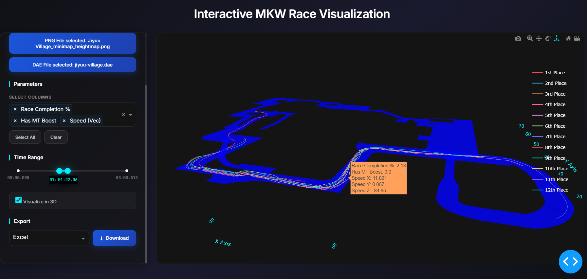
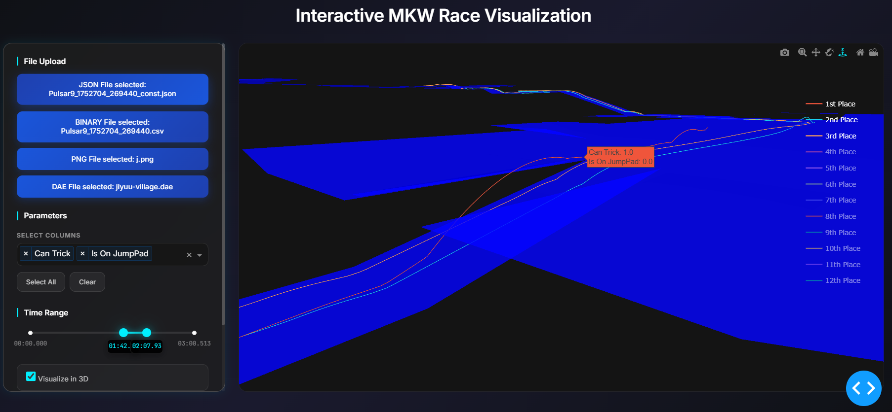

# Telemetry Visualizer




# Overview

This is a simple dash-based tool that allows you to visualize the data extracted by our [MKW Logger](https://github.com/baralll/mkw-logger). It is dash-based, meaning it is a web page with a python backend. It requires you to upload the 2 files produced by the logger, the json and the csv, as well as a 3D model (.dae). Data uploaded stay local.

## Description

Some features:

- You can choose what data are visible when you hover a trace with the "select column" mulitple select dropdown. 
- The range slider allow you to select a time range into the race.
- On the right side, you can choose to hide/unhide the traces of the players you want.
- you can export the data parsed from the binary csv into an actual csv or an excel file so that you can read it/browse it manually. The file may be slightly heavy depending on the datapoints extracted and the duration of the race. A default (default logger and 3min race) would produce a ~60MB file.

!!! note 
    The data used for the screenshots uses the custom track [Jiyuu Village](https://wiki.tockdom.com/wiki/Jiyuu_Village) and a manually driven race by the author with CPUs

## Getting Started

Follow these instructions to set up the project on your local machine.

### Prerequisites

*   Minimum required versions: 3.10+
*   pip (Python package installer)

### Installation

1.  **Clone the repository**
    ```bash
    git clone https://github.com/baralll/kartographer.git
    cd your-project-name
    ```

2.  **Create a Virtual Environment**
    It is recommended to use a virtual environment to keep dependencies separate.

    *   **macOS / Linux:**
        ```bash
        python3 -m venv .venv
        source .venv/bin/activate
        ```
    *   **Windows (PowerShell):**
        ```powershell
        python -m venv .venv
        .\.venv\Scripts\Activate.ps1
        ```

3.  **Install Dependencies**
    Install the required packages from `requirements.txt`.
    ```bash
    pip install -r requirements.txt
    ```

### Usage

To run the application, execute:

```bash
python -m mkwdashboard.dash_main
```